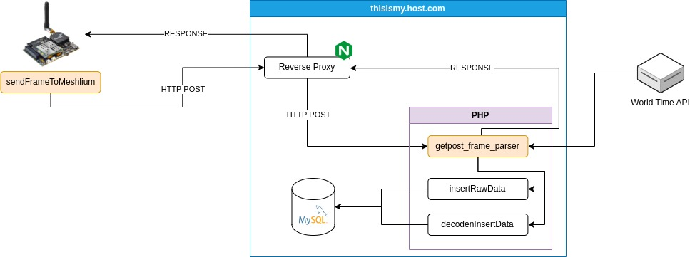

# Waspmote HUB



I made this interface to get data from Libelium's P&S Waspmotes, like Meshlium's does. This implementation expects a 134 frame type.


When using `_4G.sendFrameToMeshlium` to send data, the P&S Waspmote will search for the `getpost_frame_parser.php` file in the specified `host`. So in our case this file must be place on root directory `thisismy.host.com`, wich is also set as `host` on the P&S Waspmote code.

Also, P&S Waspmotes `_4G.sendFrameToMeshlium` method use HTTP comunication. So in our case our NGINX reverse proxy must include the next rules on it's configuration file, to allow HTTP traffic to reach `getpost_frame_parser.php`.

```

# Allow HTTP trafic only to getpost_frame_parser.php
location /getpost_frame_parser.php {
    root /var/www/html/my_host/getpost_frame_parser.php;
}

# Redirect all other traffic from HTTP to HTTPS
location / {
    if ($scheme = http){
        return 301 https://$server_name$request_uri;
    }
    try_files $uri $uri/ /index.html;
}
```

After adding new rules, we can validate the new configuration:

```
sudo nginx -t
```

And restart gracefully NGINX:

```
sudo systemctl reload nginx
```